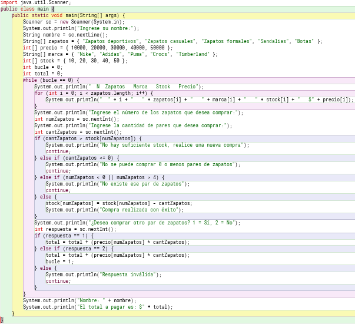
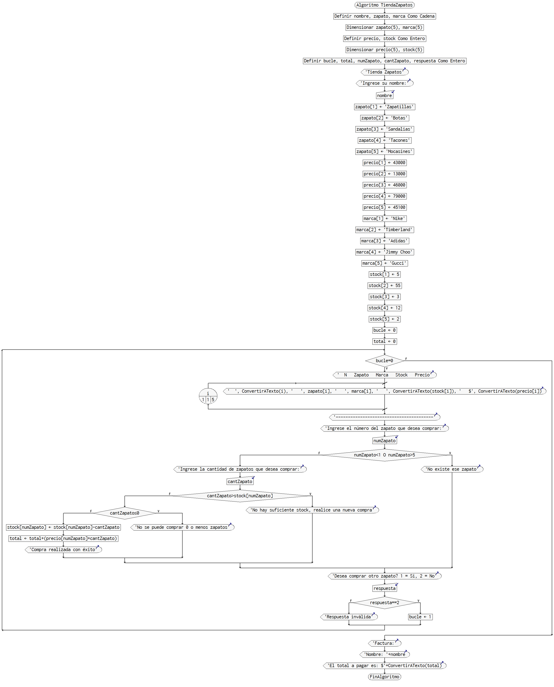
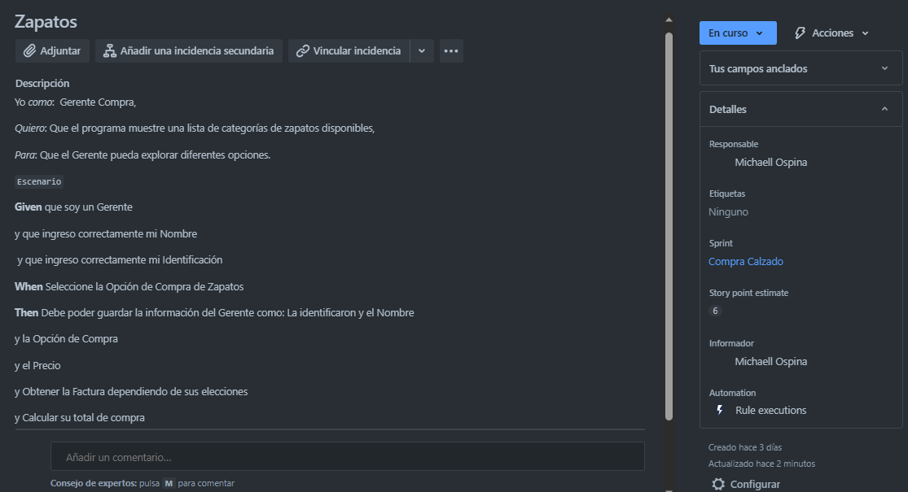
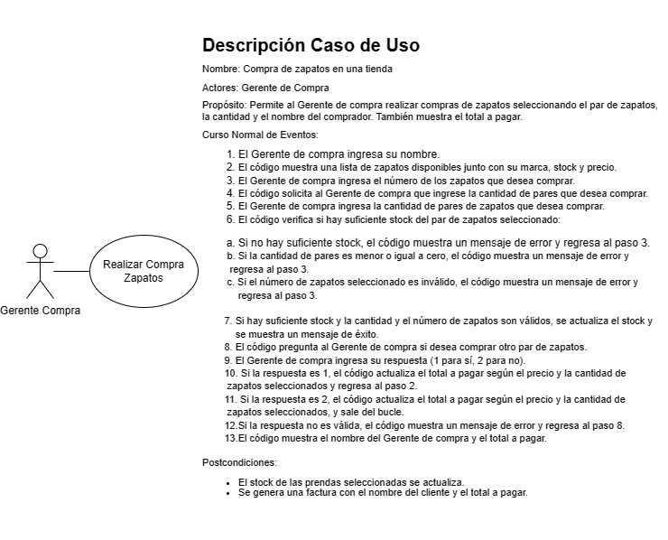

<h1>Proyecto Ropa</h1>

Programa en consola para una tienda de ropa. Permite al Gestor de Compra y Venta seleccionar y comprar prendas de vestir disponibles en el inventario. Al finalizar, genera una factura con el nombre del comprador, la fecha y el total a pagar.

<h4>El programa sigue el siguiente flujo:</h4>

1. Solicita al Gestionador que ingrese su nombre.

2. Muestra una lista de prendas disponibles con su respectiva marca, stock y precio.

3. Pregunta al Gestionador qué prenda desea comprar y cuántas unidades.

4. Verifica si hay suficiente stock y si la cantidad ingresada es válida.

5. Actualiza el stock si la compra es válida y muestra un mensaje de confirmación.

6. Pregunta al Gestionador si desea comprar otra prenda.

7. Calcula el total a pagar sumando el precio de las prendas compradas.

8. Repite los pasos 3-7 hasta que el Gestionador no desee comprar más prendas.

9. Muestra la factura final con el nombre del Gestionador, la fecha y el total a pagar.

**Nota:** Este código asume que el Gestionador ingresará valores numéricos válidos y no se han implementado controles adicionales para manejar situaciones excepcionales.
<h2>Codigo Java</h2>

<h2>Diagrama de Flujo</h2>

<h2>Jira</h2>

<h2>Caso de Uso</h2>

